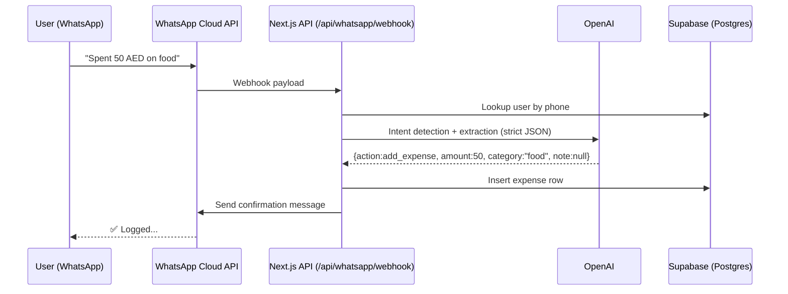
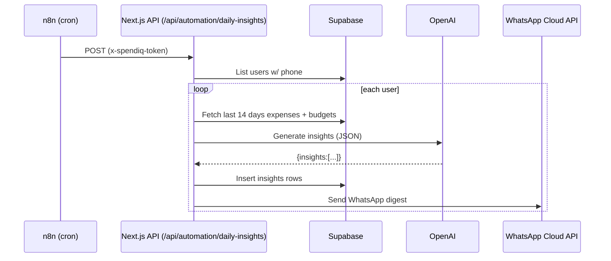

# Spendiq AI — Architecture

Spendiq is built as a **WhatsApp-first finance assistant** with a clean dashboard for visibility and control.

## High-level components

- **Next.js 14 app**
  - Dashboard (`/dashboard`) for spend visibility, budgets, and insights
  - API routes for WhatsApp ingestion + automation jobs
- **Supabase**
  - Auth (magic link)
  - Postgres with RLS policies
  - Realtime-ready tables (expenses/insights)
- **OpenAI**
  - Intent detection (strict JSON)
  - Insight generation
  - Monthly report generation
- **WhatsApp Cloud API**
  - Webhook ingestion + outbound messages
- **n8n**
  - Schedules and pipelines (daily insights, budget checks, monthly reports)

## Data model

Tables:
- `users`: profile + phone mapping to WhatsApp sender
- `expenses`: canonical ledger of spend events
- `budgets`: per-category limits
- `insights`: short AI messages
- `reports`: monthly summary JSON

## Request flows

### WhatsApp expense capture (built-in webhook)

### Daily insights (n8n cron → automation endpoint)

### Budget alerts

Budget checks run hourly (or any cadence):
- compute monthly spend per category
- if \(spent >= limit\), send warning + insert insight

### Monthly report

Monthly report job:
- aggregates month totals + top categories
- OpenAI generates:
  - `summary_json` for storage
  - WhatsApp formatted message for delivery

## Security model

- **RLS everywhere**: dashboard access is scoped to `auth.uid()`
- **Service role only on server**:
  - WhatsApp webhook insertion
  - Automation endpoints
- **Automation endpoints protected** with `AUTOMATION_TOKEN` header

## Scalability notes (startup-grade)

- **Stateless app servers**: Next.js API routes can scale horizontally.
- **DB indexes**: `expenses(user_id, created_at)` and `expenses(user_id, category)` keep queries fast.
- **AI cost control**:
  - deterministic extraction model (`temperature: 0`)
  - insights + reports run on cron
- **Extensibility**:
  - add “merchant detection”, “receipt OCR”, “bank sync” as separate pipelines
  - introduce multi-currency and normalized categories as separate tables later

